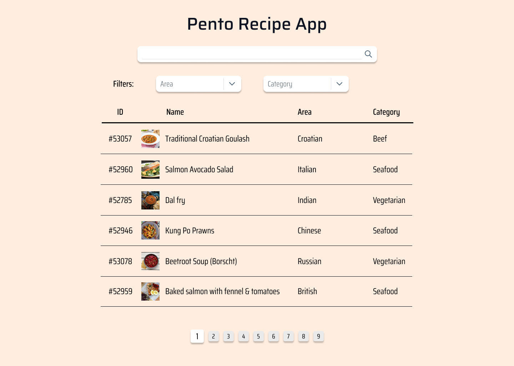

# Recipe App List View

**Home Assignment | Ssr Full-Stack Developer @ Pento**

## Description

Your task is to create the list view of a recipe app in React, given a mockup and a tech specification. The app uses the [The Meal DB API](https://www.themealdb.com/api.php) to retrieve the data.

## Technical Specification

### The app must have:

-   A search bar.
    
-   A list of meals that resulted from the search showing fields id, name, area, category.
    
-   A field to filter by category.
    
-   A custom hook useMeals to fetch data from the API.
    

  

### Not mandatory, but it would be nice if the app had:

-   Typescript.
    
-   Auto refetching built from scratch on the useMeals hook, to re-validate data every 10 seconds (no libraries allowed).
    
-   A field to filter by area.
    
-   Pagination.
    

## Design Mockup

This is the mockup that the design team came up with. Be as true to the mockup as possible. You may use your preferred styling framework (tailwind, chakra, sass, etc.). Focus on keeping the UI simple, with no additional features than what are described in the technical specification.

  

## What is expected

-   A working implementation of the Pento Recipe App in React, with as little use of external libraries as possible (excluding styling framework).
    
-   Implementation of the must specification and the ones you choose to do in the not mandatory specification (the more the best).
    
-   Clean, well-documented code that adheres to best practices.
    
-   A README file with instructions on how to run the application, as well as any additional information the candidate considers relevant.
    
-   The challenge is expected to be solved in no more than 5 hours.
    
-   Focus on meeting the requirements and keeping the solution simple, with no additional features beyond what's described in the challenge.
    

## Submission Instructions and Next Steps

-   Version your code using Git and push your solution to a GitHub repository (inviting [psoto](https://github.com/psoto) and [brainsaysno](https://github.com/brainsaysno)).
    
-   Make sure to use Git properly by creating meaningful commit messages and organizing your code history.
    
-   If your submission is successful, you will be invited to an in-person interview, where you will present your solution, demo it, and discuss potential new features.
    

## Disclaimers

#### Limited Time Expectation

-   We understand that this assignment is being completed under a limited timeframe. Therefore, we do not expect exhaustive, fully polished deliverables. The primary aim is to assess your approach, creativity, and fundamental skills. Quality and thoughtfulness are preferred over quantity and extensive detail.
    

#### External Tools Usage

-   In Pento we encourage the usage of tools (Stack Overflow, Copilot, ChatGPT, etc.) to enhance performance. However for this assignment it is much preferred to primarily rely on your intrinsic knowledge and creativity and showcase your individual capabilities.
    
-   In case you do use code completely from any of these tools, leave a comment on which tools were used where.
